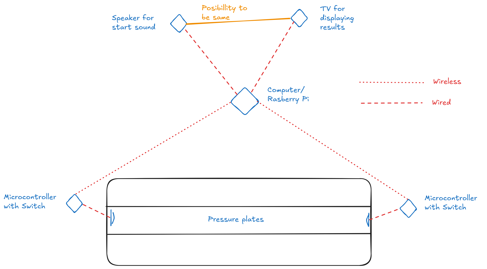

# D7039E Project - Swimming Timer
Accurate timing is a crucial part of both swimming competitions and training sessions. Existing professional timing systems are often reliable, but can be very expensive and difficult to set up, making them less accessible to smaller swimming clubs or individual athletes. This creates a need for a solution that is both affordable and adaptable while expanding on the idea of modern functionality.

The purpose of this project is to design and implement a modular timing system for swimming. The system will be built to provide accurate lap timing, digital tracking, and support for swimmer identification, so that personal bests and results can be stored and displayed in real time. 

# Rough sketch
